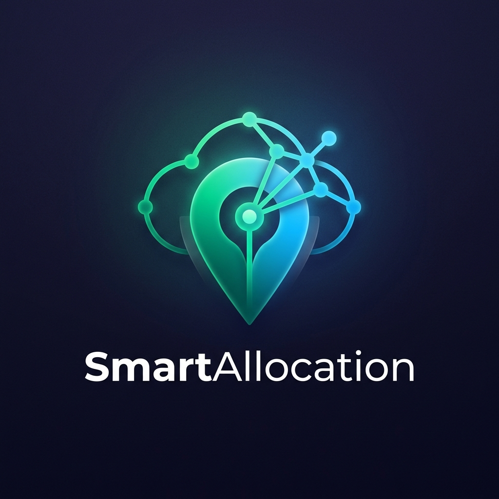

<div align="center">
<br/>



<br/>
<br/>

# SmartAllocation

**Connect volunteers to communities that need them most.**

AI-powered matching · Live geo maps · Real-time collaboration

<br/>

[](https://supabase.com)
[](https://ai.google.dev)
[](https://developer.mozilla.org/docs/Web/JavaScript)

</div>

---

## What is this?

SmartAllocation is a web platform that helps NGOs post community needs and automatically matches them with the right volunteers — using AI embeddings, priority scoring, and real-time maps.

NGOs describe what they need. Volunteers describe their skills. The platform figures out who should work together.

---

## Features

| | Feature | What it does |
|---|---|---|
| 🗺️ | **Live Need Map** | Interactive map with heatmap overlay showing needs by urgency |
| 🤖 | **AI Matching** | Semantic volunteer-to-need matching via Gemini + pgvector similarity |
| 📊 | **Priority Engine** | Auto-scores needs by urgency, impact, age, and resource gap |
| 📥 | **AI Data Ingestion** | Upload PDF/TXT reports — Gemini extracts structured data automatically |
| 💬 | **Real-time Chat** | Per-task messaging between NGOs and volunteers with unread badges |
| 🔔 | **Push Alerts** | Browser notifications for high-urgency needs |
| 📈 | **Live KPIs** | Dashboard cards: response time, match quality, unmet needs trend |
| 🔐 | **Role-based Auth** | Separate dashboards and flows for NGO and Volunteer accounts |

---

## Tech Stack

```
Frontend    Vanilla JS (ES6), HTML, Tailwind CSS
Maps        Leaflet.js + Leaflet.heat
Charts      Chart.js
Backend     Supabase (Postgres, Auth, Realtime, RLS, pgvector)
AI          Google Gemini API (embeddings + text generation)
Fonts       Sora + DM Sans
```

---

## Getting Started

### Prerequisites

- [Supabase](https://supabase.com) project with `pgvector` extension enabled
- [Google Gemini API key](https://ai.google.dev)
- Python 3

### Setup

**1. Clone the repo**
```bash
git clone https://github.com/your-username/smart-allocation.git
cd smart-allocation
```

**2. Create `config.js` in the project root**
```js
window.CONFIG = {
  SUPABASE_URL: "https://your-project.supabase.co",
  SUPABASE_ANON_KEY: "your-anon-key",
  GEMINI_API_KEY: "your-gemini-api-key",
  GEMINI_MODEL: "gemini-3.1-flash-lite-preview",
  GEMINI_EMBEDDING_MODEL: "gemini-embedding-001",
  GEMINI_EMBEDDING_DIMENSIONS: 1024,
};
```

**3. Run the database schema**

Paste `schema.sql` into your Supabase SQL editor, then enable **Realtime** for these tables:
`surveys` · `invitations` · `messages` · `volunteer_details`

**4. Start the app**
```bash
python -m http.server 8080
# → http://localhost:8080
```

---

## How It Works

```
Volunteer enters skills
  → Gemini generates embedding vector
  → Supabase runs cosine similarity (match_surveys RPC)
  → Matching needs appear on the map
  → Volunteer commits → NGO notified → Chat opens
```

```
NGO uploads a PDF report
  → Gemini extracts: need, urgency, category, location
  → NGO reviews and confirms
  → Need posted with embedding → appears on live map
```

---

## Project Structure

```
smart-allocation/
├── index.html               # Main map dashboard
├── login.html               # Sign in / sign up
├── register.html            # NGO registration with map pin picker
├── ngo.html                 # Survey submission + AI ingestion
├── ngo-dashboard.html       # NGO kanban mission board
├── volunteer-dashboard.html # Volunteer commitments + inbox
├── profile.html             # User profile & stats
│
├── app.js                   # Core logic: map, auth, matching, real-time
├── ngo-dashboard.js         # NGO dashboard
├── chat.js                  # Real-time chat + unread badges
├── profile.js               # Profile management
├── utils.js                 # Shared utilities
├── config.template.js       # Credentials template → copy to config.js
│
├── styles.css               # Global design system
├── schema.sql               # Full Supabase schema
└── package.json
```

> `config.js` is excluded from git. Copy `config.template.js` and fill in your keys locally.

---

## Troubleshooting

**Map not loading** — Check Leaflet CDN access and confirm `config.js` exists with valid credentials.

**No search results** — Make sure volunteer skills are filled in, `match_surveys` RPC exists in Supabase, and survey embeddings were generated on insert.

**Chat not updating** — Enable Realtime in Supabase for the relevant tables.

**Gemini errors**
- `401` → Invalid API key
- `429` → Quota exceeded; wait or upgrade billing
- `404` → Model unavailable for your key; update `GEMINI_MODEL`

---

<div align="center">
  <sub>Built to connect communities with help when it matters most.</sub>
</div>
